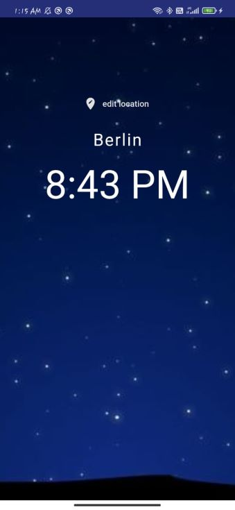
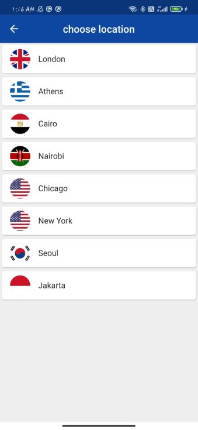

# World Time App

This app shows time of different countries. It was my first Flutter application.

## Features

- It shows the time of different countries.
- Shows the flag of different countries along with their time.
- Changes the background depending on whether it is day or night in the country.

